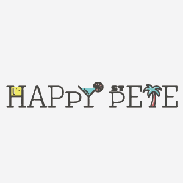

[![Contributors][contributors-shield]][contributors-url]
[![Forks][forks-shield]][forks-url]
[![Stargazers][stars-shield]][stars-url]
[![Issues][issues-shield]][issues-url]
[![MIT License][license-shield]][license-url]
[![LinkedIn][linkedin-shield]][linkedin-url]

<!-- PROJECT LOGO -->
<br />
<p align="center">
  <a href="https://github.com/apcbadal/Happy-Pete">
    
  </a>

  <h3 align="center">Happy St Pete Application</h3>

  <p align="center">
    An awesome Application for St petersburg city to help business connect with the local community that offers happy hour specials.
    <br />
    <a href="https://github.com/apcbadal/Happy-Pete"><strong>Explore the docs »</strong></a>
    <br />
    <br />
    <a href="https://play.google.com/store/apps/details?id=com.gomediashark.happypete">Download Application</a>
    ·
    <a href="https://github.com/apcbadal/Happy-Pete/issues">Report Bug</a>
    ·
    <a href="https://github.com/apcbadal/Happy-Pete/issues">Request Feature</a>
  </p>
</p>


<!-- TABLE OF CONTENTS -->
<details open="open">
  <summary>Table of Contents</summary>
  <ol>
    <li>
      <a href="#about-the-project">About The Project</a>
      <ul>
        <li><a href="#built-with">Built With</a></li>
      </ul>
    </li>
    <li>
      <a href="#getting-started">Getting Started</a>
      <ul>
        <li><a href="#prerequisites">Prerequisites</a></li>
        <li><a href="#installation">Installation</a></li>
      </ul>
    </li>
    <li><a href="#usage">Usage</a></li>
    <li><a href="#roadmap">Roadmap</a></li>
    <li><a href="#contributing">Contributing</a></li>
    <li><a href="#license">License</a></li>
    <li><a href="#contact">Contact</a></li>
    <li><a href="#acknowledgements">Acknowledgements</a></li>
  </ol>
</details>


<!-- ABOUT THE PROJECT -->
## About The Project

[![Product Name Screen Shot][product-screenshot]](images/logo.png)

Happy St Pete application was created to help businesses connect with the local community that offers happy hour specials. We focus on offering the best deals locally around the topics of food, specialty drinks, cocktails, and beer. We also want to help small businesses and local restaurants grow by connecting them to people and it easy to use application. We found that in our local market it's hard to find good deals on drink and food, especially during happy hour. This app was created to solve that problem.

### Built With


* [React Native](https://reactnative.dev/)
* [Firebase](https://firebase.google.com/)


<!-- GETTING STARTED -->
## Getting Started

Install required sofware which is given below -

### Prerequisites

* Download and install the latest [Node.js](https://nodejs.org/en/)
* Install React the native cli globally

  ````sh
  npm instal react-native-cli -g
  ````
* Setting up Android Development Environment <br>
[Please use this link to setup your environment](https://reactnative.dev/docs/environment-setup)

* npm
  ```sh
  npm install npm@latest -g
  ```

### Installation

1. [Create a project in your firebase account and get API key](https://firebase.google.com/) 
2. [Get your API key for Google Maps from Google Cloud](https://cloud.google.com/)
2. Clone the repo
   ```sh
   git clone https://github.com/apcbadal/Happy-Pete.git
   ```
3. Install NPM packages
   ```sh
   npm install
   ```
4. Enter your API in `config.js`
   ```JS
       apiKey: 'API_KEY',
       authDomain: 'AUTH_DOMAIN',
       databaseURL: 'DATABASE_URL',
       projectId: 'PROJECT_ID',
       storageBucket: 'STORAGE_BUCKET',
       messagingSenderId: 'MESSAGING_SENDER_ID',
       appId: 'APP_ID'
   ```


<!-- USAGE EXAMPLES -->
## Usage

Here's the few screenshots of application 
[![Product Details Screen Shot][mockup-landing-screen]](images/iPhone%20X%20Flying%20Mockup4.png)
[![Product Landing Screen Shot][mockup-home-screen]](images/A%20Hand%20Holding%20An%20iPhone%2012%20Mini%20Mockup.png)
[![Product Details Screen Shot][mockup-bardetails-screen]](images/iPhone%20X%20Flying%20Mockup4.png)
[![Product All Place screen shot][mockup-allplace-screen]](images/iPhone%2012%20Pro%206.1_%20Mockup5.png)


_For more , please refer to the [Happy St Pete Application](https://play.google.com/store/apps/details?id=com.gomediashark.happypete)_


<!-- ROADMAP -->
## Roadmap

See the [open issues](https://github.com/apcbadal/happy-pete/issues) for a list of proposed features (and known issues).


<!-- CONTRIBUTING -->
## Contributing

Contributions are what make the open source community such an amazing place to be learn, inspire, and create. Any contributions you make are **greatly appreciated**.

1. Fork the Project
2. Create your Feature Branch (`git checkout -b feature/AmazingFeature`)
3. Commit your Changes (`git commit -m 'Add some AmazingFeature'`)
4. Push to the Branch (`git push origin feature/AmazingFeature`)
5. Open a Pull Request


<!-- LICENSE -->
## License

Distributed under the MIT License. See `LICENSE` for more information.


<!-- CONTACT -->
## Contact

Your Name - [@apcbadal](https://twitter.com/anshumanbadal) - apcbadal@gmail.com

Project Link: [https://github.com/apcbadal/Happy-Pete](https://github.com/apcbadal/Happy-Pete)

Download Application from [Google Play](https://play.google.com/store/apps/details?id=com.gomediashark.happypete)


<!-- ACKNOWLEDGEMENTS -->
## Acknowledgements
* [GitHub Emoji Cheat Sheet](https://www.webpagefx.com/tools/emoji-cheat-sheet)
* [Img Shields](https://shields.io)
* [Choose an Open Source License](https://choosealicense.com)
* [GitHub Pages](https://pages.github.com)


<!-- MARKDOWN LINKS & IMAGES -->
<!-- https://www.markdownguide.org/basic-syntax/#reference-style-links -->
[contributors-shield]: https://img.shields.io/github/contributors/apcbadal/happy-pete.svg?style=for-the-badge
[contributors-url]: https://github.com/apcbadal/happy-pete/graphs/contributors
[forks-shield]: https://img.shields.io/github/forks/apcbadal/happy-pete.svg?style=for-the-badge
[forks-url]: https://github.com/apcbadal/happy-pete/network/members
[stars-shield]: https://img.shields.io/github/stars/apcbadal/happy-pete.svg?style=for-the-badge
[stars-url]: https://github.com/apcbadal/happy-pete/stargazers
[issues-shield]: https://img.shields.io/github/issues/apcbadal/happy-pete.svg?style=for-the-badge
[issues-url]: https://github.com/apcbadal/happy-pete/issues
[license-shield]: https://img.shields.io/github/license/apcbadal/happy-pete.svg?style=for-the-badge
[license-url]: https://github.com/apcbadal/happy-pete/blob/master/LICENSE
[linkedin-shield]: https://img.shields.io/badge/-LinkedIn-black.svg?style=for-the-badge&logo=linkedin&colorB=555
[linkedin-url]: https://linkedin.com/in/apcbadal
[product-screenshot]: images/logo.png
[mockup-landing-screen]:images/A%20Hand%20Holding%20An%20iPhone%2012%20Mini%20Mockup.png
[mockup-home-screen]:images/iPhone%2012%20Pro%206.1_%20Mockup2.png
[mockup-bardetails-screen]:images/iPhone%20X%20Flying%20Mockup4.png
[mockup-allplace-screen]:images/iPhone%2012%20Pro%206.1_%20Mockup5.png
